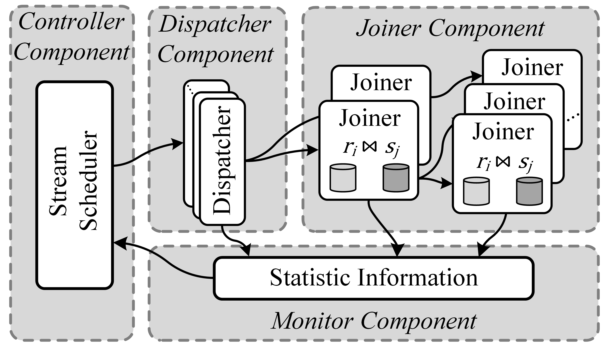

# Eunomia
Eunomia is a novel distributed stream join system  which leverages an ordered propagation model for efficiently eliminating abnormal results. Eunomia achieves a self-adaptive strategy to adjust the structure according to the dynamic stream input rates and workloads.  Experiment results show that Eunomia eliminates abnormal results to guarantee the completeness, improves the system throughput by 25\% and reduces the processing latency by 74\% compared to state-of-the-art designs.

## Introduction
With the emergence of big data applications, real world systems often need to provide high quality of services by enabling real time processing of continues stream data, e.g., algorithmic trading, targeted advertising, and on-demand ride-hailing. These applications rely on an important operation of stream join,  which compares tuples from two data streams and outputs appropriate results. Basically, an efficient stream join system needs to satisfy three main requirements: **scalability**, **high performance** and **completeness**.

Lin et al. propose BiStream, a scalable stream join system which is based on a bipartite graph structure. BiStream divides all the join units in a cluster into two separate parts and organizes them into a complete bipartite graph. Each part of the bipartite graph is responsible for storing tuples from one stream and processing tuples from the other stream. However,  the join model of BiStream  can  raise  abnormalresults in large-scale distributed stream join systems, leading to result incompleteness. BiStream just uses a straightforward  synchronization  strategy  based  on  the  streampunctuation  mechanism  among  join  units  to  alleviate abnormal results. But the the strategy greatly degrades the system performance, especially for processing latency.

To solve this problem, in this work, we design Eunomia, a novel distributed stream join system to eliminate abnormal stream join results using a light-weighted ordered propagation model. The model organizes all join units as a tree-base structure and lets all  join units process and forward tuples concurrently. We further design a self-adaptive structure adjustment strategy to cope with the high dynamic of a stream.


## Design

Eunomia consists of four components: *joiner*, *dispatcher*, *controller*, and *monitor*. The *joiner* is a key component in the system which constructs all join units as an ordered propagation model. Meanwhile, the *joiner* is responsible for performing the join operation. The *dispatcher* dispatches tuples from data sources to the *joiner*. The *controller* decides the structure of the ordered propagation model based on the actual workloads in the system. The *joiner* adjusts the structure of the model based on the configuration information from the *controller*. The *monitor* collects the workload statistics from each join unit and transfers the information to *controller* in real time.

The key design of Eunomia is the ordered propagation model which consists of dispatchers and joiners. The model organizes joiners to an *m-ary* tree structure, where *m* is the degree of all the nodes in the tree structure.  Tuples transmitted from dispatchers arrive at the root joiners of the structure. The root joiners process tuples and forward them to its child joiners, and the same is true for the procedure in child joiners. Therefore, tuples are broadcast to all joiners and processed in each joiner.


## How to build and run？
### Environment
We implement Eunomia atop [Apache Storm](http://storm.apache.org/2018/06/04/storm122-released.html) (version 1.2.2), and deploy the system on a cluster. Each machine is equipped with an octa-core 2.4GHz Xeon CPU, 64.0GB RAM, and a 1000Mbps Ethernet interface card. One machine in the cluster serves as the master node to host the Storm Nimbus. The other machines run Storm supervisors.

### Build
We construct the project of Eunomia by Maven(<https://maven.apache.org/>). 

Build and package to generate excutable jar file with following command:
```
mvn clean package                   
```

### Run
Install Apache Storm (Please refer to <http://storm.apache.org/> to learn more).

Submit the jar file of Eunomia to Storm with following command:
```
storm jar Eunomia-1.0-SNAPSHOT.jar com.basic.core.Topology -n 256 -ks 1 -sf 5 -dp 5 -pj 256 -root 4 -degree 4 --remote
```

## Publications
If you want to know more detailed information, please refer to this paper: 

Jie Yuan, Yonghui Wang, Hanhua Chen, Hai Jin, Haikun Liu. "Eunomia: Efficiently Eliminating Abnormal Resultsin Distributed Stream Join Systems" in Proceedings of 29th IEEE/ACM International Symposium on Quality of Service (IWQoS), 2021.

## Authors and Copyright
Eunomia is developed in National Engineering Research Center for Big Data Technology and System, Cluster and Grid Computing Lab, Services Computing Technology and System Lab, School of Computer Science and Technology, Huazhong University of Science and Technology, Wuhan, China by Jie Yuan(<jieyuan@hust.edu.cn>), Yonghui Wang(<yhw@hust.edu.cn>), Hanhua Chen(<chen@hust.edu.cn>), Hai Jin(<hjin@hust.edu.cn>), Haikun Liu(<hkliu@hust.edu.cn>).

Copyright (C) 2021, [SCTC & CGCL](http://grid.hust.edu.cn/) and [Huazhong University of Science and Technology](https://www.hust.edu.cn/).
